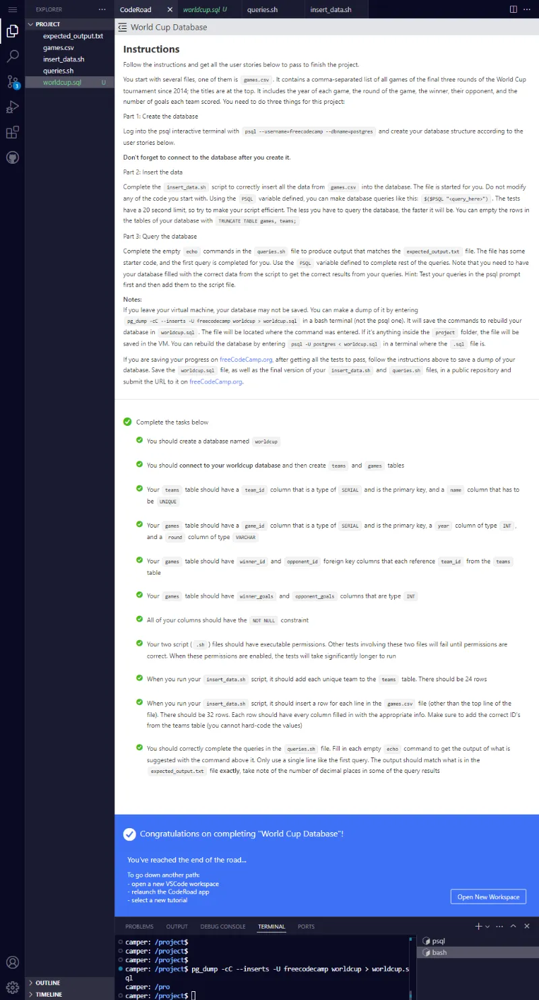
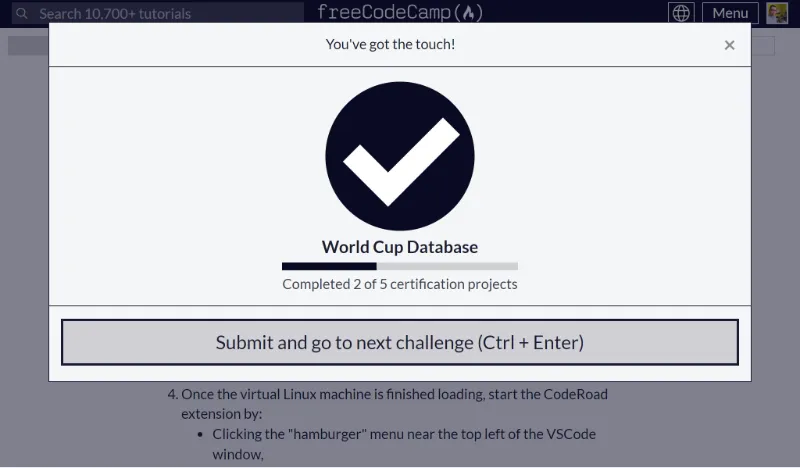

# Resolución Proyecto Build a World Cup Database

Repositorio con los archivos requeridos para aprobar el proyecto **Build a World Cup Database**. Dicho proyecto corresponde al segundo proyecto requisito obligatorio para obtener la [**Relational Database Certification**](https://www.freecodecamp.org/learn/relational-database/build-a-world-cup-database-project/build-a-world-cup-database) de freecodecamp.

El proyecto utiliza bash scripting para interactuar con una base de datos ya sea insertando registros y realizando consultas una vez que los registros se han insertado.

## Tabla de Contenidos

- [Resolución Proyecto Build a World Cup Database](#resolución-proyecto-build-a-world-cup-database)
  - [Tabla de Contenidos](#tabla-de-contenidos)
  - [Instrucciones](#instrucciones)
    - [Part 1: Create the database](#part-1-create-the-database)
    - [Part 2: Insert the data](#part-2-insert-the-data)
    - [Part 3: Query the database](#part-3-query-the-database)
  - [All Passed](#all-passed)
  - [Proyecto Entregado y Aprobado](#proyecto-entregado-y-aprobado)
  - [Scripts](#scripts)
    - [Script de Inserción de data a tablas de base de datos](#script-de-inserción-de-data-a-tablas-de-base-de-datos)
    - [Script que ejecuta queries a las tablas de la base de datos](#script-que-ejecuta-queries-a-las-tablas-de-la-base-de-datos)

## Instrucciones

Follow the instructions and get all the user stories below to pass to finish the project.

You start with several files, one of them is games.csv. It contains a comma-separated list of all games of the final three rounds of the World Cup tournament since 2014; the titles are at the top. It includes the year of each game, the round of the game, the winner, their opponent, and the number of goals each team scored. You need to do three things for this project:

### Part 1: Create the database

Log into the psql interactive terminal with psql --username=freecodecamp --dbname=postgres and create your database structure according to the user stories below.

Don't forget to connect to the database after you create it.

### Part 2: Insert the data

Complete the insert_data.sh script to correctly insert all the data from games.csv into the database. The file is started for you. Do not modify any of the code you start with. Using the PSQL variable defined, you can make database queries like this: $($PSQL "<query_here>"). The tests have a 20 second limit, so try to make your script efficient. The less you have to query the database, the faster it will be. You can empty the rows in the tables of your database with TRUNCATE TABLE games, teams;

### Part 3: Query the database

Complete the empty echo commands in the queries.sh file to produce output that matches the expected_output.txt file. The file has some starter code, and the first query is completed for you. Use the PSQL variable defined to complete rest of the queries. Note that you need to have your database filled with the correct data from the script to get the correct results from your queries. Hint: Test your queries in the psql prompt first and then add them to the script file.

Notes:
If you leave your virtual machine, your database may not be saved. You can make a dump of it by entering pg_dump -cC --inserts -U freecodecamp worldcup > worldcup.sql in a bash terminal (not the psql one). It will save the commands to rebuild your database in worldcup.sql. The file will be located where the command was entered. If it's anything inside the project folder, the file will be saved in the VM. You can rebuild the database by entering psql -U postgres < worldcup.sql in a terminal where the .sql file is.

If you are saving your progress on freeCodeCamp.org, after getting all the tests to pass, follow the instructions above to save a dump of your database. Save the worldcup.sql file, as well as the final version of your insert_data.sh and queries.sh files, in a public repository and submit the URL to it on freeCodeCamp.org.

Complete the tasks below

You should create a database named worldcup

You should connect to your worldcup database and then create teams and games tables

Your teams table should have a team_id column that is a type of SERIAL and is the primary key, and a name column that has to be UNIQUE

Your games table should have a game_id column that is a type of SERIAL and is the primary key, a year column of type INT, and a round column of type VARCHAR

Your games table should have winner_id and opponent_id foreign key columns that each reference team_id from the teams table

Your games table should have winner_goals and opponent_goals columns that are type INT

All of your columns should have the NOT NULL constraint

Your two script (.sh) files should have executable permissions. Other tests involving these two files will fail until permissions are correct. When these permissions are enabled, the tests will take significantly longer to run

When you run your insert_data.sh script, it should add each unique team to the teams table. There should be 24 rows

When you run your insert_data.sh script, it should insert a row for each line in the games.csv file (other than the top line of the file). There should be 32 rows. Each row should have every column filled in with the appropriate info. Make sure to add the correct ID's from the teams table (you cannot hard-code the values)

You should correctly complete the queries in the queries.sh file. Fill in each empty echo command to get the output of what is suggested with the command above it. Only use a single line like the first query. The output should match what is in the expected_output.txt file exactly, take note of the number of decimal places in some of the query results

## All Passed

A continuación muestro un screenshot con todos los test aprobados:



## Proyecto Entregado y Aprobado



## Scripts

### Script de Inserción de data a tablas de base de datos

```bash
#! /bin/bash

if [[ $1 == "test" ]]
then
  PSQL="psql --username=postgres --dbname=worldcuptest -t --no-align -c"
else
  PSQL="psql --username=freecodecamp --dbname=worldcup -t --no-align -c"
fi

# Do not change code above this line. Use the PSQL variable above to query your database.

echo $($PSQL "TRUNCATE TABLE games, teams;")

cat games.csv | while IFS="," read YEAR ROUND WINNER OPPONENT WINNER_GOALS OPPONENT_GOALS
do
  if [[ $YEAR != year ]]
  then
    WINNER_ID=$($PSQL "SELECT team_id FROM teams WHERE name = '$WINNER'")
    OPPONENT_ID=$($PSQL "SELECT team_id FROM teams WHERE name = '$OPPONENT'")
    if [[ -z $WINNER_ID ]]
    then
      INSERT_WINNER_RESULT=$($PSQL "INSERT INTO teams(name) VALUES('$WINNER')")
      if [[ $INSERT_WINNER_RESULT == "INSERT 0 1" ]]
      then
        echo Inserted into teams $WINNER
      fi
      WINNER_ID=$($PSQL "SELECT team_id FROM teams WHERE name = '$WINNER'")
    fi


    if [[ -z $OPPONENT_ID ]]
    then
      INSERT_OPPONENT_RESULT=$($PSQL "INSERT INTO teams(name) VALUES('$OPPONENT')")
      if [[ $INSERT_OPPONENT_RESULT == "INSERT 0 1" ]]
      then
        echo Inserted into teams $OPPONENT
      fi
      OPPONENT_ID=$($PSQL "SELECT team_id FROM teams WHERE name = '$OPPONENT'")
    fi
    # tengo winner_id y opponent_id

    INSERT_GAME_INTO_GAMES=$($PSQL "INSERT INTO games(year, round, winner_id, opponent_id, winner_goals, opponent_goals) VALUES($YEAR, '$ROUND', $WINNER_ID, $OPPONENT_ID, $WINNER_GOALS, $OPPONENT_GOALS)")
    if [[ $INSERT_GAME_INTO_GAMES == "INSERT 0 1" ]]
    then
      echo Inserted into games $YEAR $ROUND $WINNER_ID $OPPONENT_ID $WINNER_GOALS $OPPONENT_GOALS
    fi
  fi
done
```

### Script que ejecuta queries a las tablas de la base de datos

```bash
#! /bin/bash

PSQL="psql --username=freecodecamp --dbname=worldcup --no-align --tuples-only -c"

# Do not change code above this line. Use the PSQL variable above to query your database.

echo -e "\nTotal number of goals in all games from winning teams:"
echo "$($PSQL "SELECT SUM(winner_goals) FROM games")"

echo -e "\nTotal number of goals in all games from both teams combined:"
echo "$($PSQL  "SELECT SUM(winner_goals)+SUM(opponent_goals) FROM games")"

echo -e "\nAverage number of goals in all games from the winning teams:"
echo "$($PSQL "SELECT AVG(winner_goals) FROM games")"

echo -e "\nAverage number of goals in all games from the winning teams rounded to two decimal places:"
echo "$($PSQL "SELECT ROUND(AVG(winner_goals),2) FROM games")"

echo -e "\nAverage number of goals in all games from both teams:"
echo  "$($PSQL "SELECT ROUND(AVG(winner_goals)+AVG(opponent_goals),16) FROM games")"

echo -e "\nMost goals scored in a single game by one team:"
echo  "$($PSQL "SELECT MAX(winner_goals) FROM games")"

echo -e "\nNumber of games where the winning team scored more than two goals:"
echo  "$($PSQL "SELECT COUNT(*) FROM games WHERE winner_goals>2")"

echo -e "\nWinner of the 2018 tournament team name:"
echo  "$($PSQL "SELECT teams.name FROM games INNER JOIN teams ON games.winner_id=teams.team_id WHERE round='Final' AND year=2018")"

echo -e "\nList of teams who played in the 2014 'Eighth-Final' round:"
echo  "$($PSQL "SELECT name FROM teams WHERE team_id IN (SELECT winner_id FROM games WHERE round='Eighth-Final' AND year=2014) OR team_id IN (SELECT opponent_id FROM games WHERE round='Eighth-Final' AND year=2014) ORDER BY name")"

echo -e "\nList of unique winning team names in the whole data set:"
echo  "$($PSQL "SELECT name FROM teams WHERE team_id IN (SELECT winner_id FROM games) ORDER BY name")"

echo -e "\nYear and team name of all the champions:"
echo  "$($PSQL "SELECT year,name FROM games INNER JOIN teams ON games.winner_id=teams.team_id WHERE round='Final' ORDER BY year")"

echo -e "\nList of teams that start with 'Co':"
echo  "$($PSQL "SELECT name FROM teams WHERE name LIKE 'Co%' ORDER BY name")"

```
